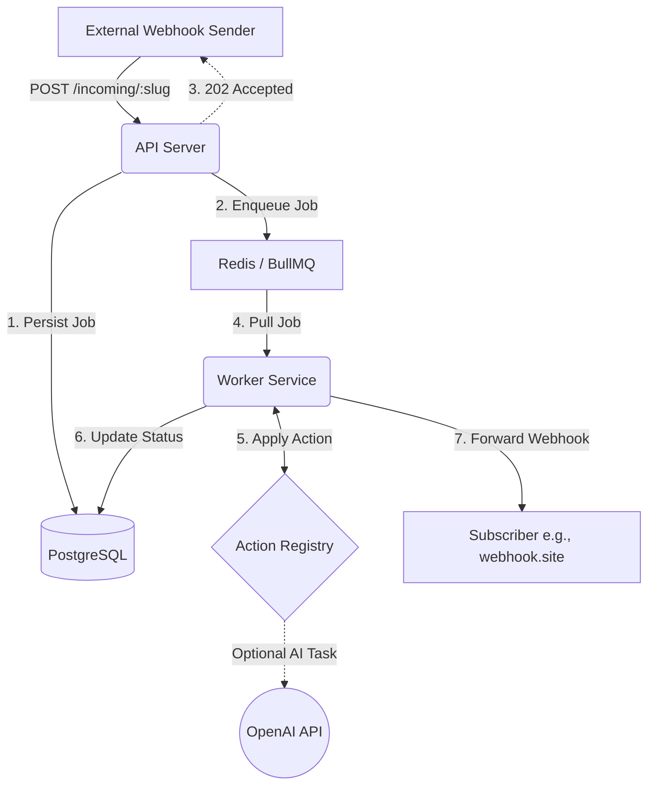

#  Webhook Pipeline Service

A robust, asynchronous webhook ingestion and processing service. This application allows you to define pipelines that receive webhooks, perform predefined transformations or AI-powered analysis on the payloads, and reliably forward the processed data to multiple subscriber endpoints.

## 🛠️ Tech Stack

<p align="left">
  
  
  
  
  
  
  
  
</p>

## 🏗️ Architecture

The system is built with a highly decoupled, asynchronous architecture designed for resilience and fast response times.



1.  **API Server (Express):** Receives incoming webhooks, immediately persists them to the database, enqueues them for processing, and quickly responds to the sender with a `202 Accepted`. It also exposes administrative REST endpoints for pipeline management.
2.  **Message Queue (Redis / BullMQ):** Acts as a buffer between the API and the worker. Ensures jobs are processed reliably, handling retries, delays, and concurrency control.
3.  **Database (PostgreSQL / Drizzle ORM):** The source of truth. Stores pipeline configurations, subscriber URLs, job statuses, original payloads, and system audit logs.
4.  **Worker Service:** Runs in the background, independently of the API. It pulls jobs from the queue, executes the designated "Action" (transformation or AI analysis) on the payload, and orchestrates the delivery to all registered subscribers.

## 📂 Folder Architecture

```text
├───public/               # Frontend Dashboard UI (HTML, CSS, Vanilla JS)
│   ├───app.js
│   ├───index.html
│   └───style.css
└───src/                  # Backend Application (TypeScript)
    ├───index.ts          # API Express Server Entry Point
    ├───controllers/      # Express Route Handlers
    ├───db/               # Drizzle Database Schema and Connection
    ├───middlewares/      # Express Middlewares (Auth, Rate Limiting)
    ├───queue/            # BullMQ Queue Setup
    ├───services/         # Core Business Logic
    ├───utils/            # Utilities (Custom Logger)
    └───worker/           # Background Worker Service
        ├───index.ts      # Worker Execution Loop Entry Point
        └───actions/      # Webhook Transformation & AI Actions (Registry)
```

---

## ✨ Additional Features

-   **UI Dashboard:** A real-time visual dashboard (built with Vanilla JS and TailwindCSS) is available at `http://localhost:3000` to easily create pipelines, monitor incoming webhooks, view processed payloads, and read system logs.
-   **Authentication:** API Key authentication is implemented to secure all administrative and pipeline-management routes from unauthorized access.
-   **Rate Limiting:** Implemented on the public webhook ingestion route to protect the server from spam and DDoS attacks.
-   **Custom Logger:** A robust logging system built for deep observability, making it easy to trace requests and debug across the asynchronous boundaries of the API and the Worker.

---

## 🚀 Setup & Installation

### Prerequisites
-   [Docker](https://docs.docker.com/get-docker/) and Docker Compose
-   An OpenAI API Key (if you intend to use the AI actions)

### 1. Environment Configuration
Create a `.env` file in the root of the project. You can copy the values from the provided example or configure your own.

```env
# Database & Redis (Matching docker-compose defaults)
DATABASE_URL="postgresql://myuser:mypassword@db:5432/pipeline_db"
REDIS_HOST="redis"
REDIS_PORT="6379"

# Security
ADMIN_API_KEY="your-super-secret-admin-key"

# Integrations
OPENAI_API_KEY="sk-proj-..." 
```

### 2. Run the Application
The easiest way to start the entire stack (API, Worker, Database, Redis) is using Docker Compose:

```bash
docker-compose up --build
```

The API will be available at `http://localhost:3000`.

Once running, you can interact with the system using the visual Dashboard UI by visiting `http://localhost:3000` in your browser. Alternatively, you can hit the endpoints directly using API testing tools like Postman or Thunderclient.

*(If running locally without Docker for the Node apps, ensure you have a local Postgres and Redis running, and use `npm run dev` and `npm run worker` in separate terminals after running `npm ci` and `npm run db:push`).*

---

## 🧪 How to Test It

Testing the system involves creating a pipeline, defining where the processed webhook should go, and then sending a test payload. You can perform all these steps directly through the **UI Dashboard (`http://localhost:3000`)** or by using API testing tools like **Postman** or **Thunderclient**.

### Step 1: Get a Test Subscriber URL
If you don't have a receiving server ready, use a free webhook catcher like [webhook.site](https://webhook.site/).
1. Go to [webhook.site](https://webhook.site/) or any alternative like RequestBin.
2. Copy "Your unique URL" (e.g., `https://webhook.site/your-unique-id`).

### Step 2: Create a Pipeline

We will use the `analyze_restaurant_reviews` action as an example.
Create a pipline using the user interface or manually by sending a `POST` request to `http://localhost:3000/api/pipelines` with the header `x-api-key: your-super-secret-admin-key` and the following JSON body:

```json
{
  "name": "User Privacy Pipeline",
  "action": "mask_pii",
  "subscriberUrls": ["https://webhook.site/your-unique-id"]
}
```
*Note the `slug` returned in the JSON response, we will assume it is `user-privacy-pipeline`.*

### Step 3: Send a Webhook
Send a `POST` request to your new pipeline's ingestion endpoint at `http://localhost:3000/incoming/user-privacy-pipeline` with the following JSON payload:
or you can do this using the test webhook button in the ui dashboard  

```json
{
  "customer": "Ahmad",
  "order_id": "8842",
  "review_text": "The food was completely cold by the time it arrived, and they forgot my drink. I am never ordering from here again, I want a refund!"
}
```

### Step 4: Verify the Result
Go back to your [webhook.site](https://webhook.site/) tab. You should see a new request arrive shortly. The payload will be something like this 
```json
{
  "customer": "Ahmad",
  "order_id": "8842",
  "review_text": "The food was completely cold by the time it arrived, and they forgot my drink. I am never ordering from here again, I want a refund!",
  "ai_insights": {
    "sentiment": "Negative",
    "urgency_score": 7,
    "primary_issue": "Cold food and missing drink",
    "tags": [
      "food quality",
      "service",
      "refund",
      "customer dissatisfaction"
    ],
    "suggested_response": "We truly apologize for the inconvenience you experienced with your order. It's important to us that our food arrives hot and complete, and we regret that we fell short this time. We would like to address your concerns and ensure that you are refunded for the incomplete order. Please reach out to our customer service so we can assist you further.",
    "detected_language": "English",
    "requires_manager_callback": true
  }
}

```
---


## 📚 API Documentation

All administrative endpoints require authentication using an API key passed in the headers:
`x-api-key: your-super-secret-admin-key`

### Public Endpoints

*   `GET /health`
    *   Check if the API is running.
*   `POST /incoming/:slug`
    *   The webhook ingestion URL. Send your JSON payloads here. Rate-limited.
    *   **Response:** `202 Accepted`

### Administrative Endpoints (Requires `x-api-key`)

#### Pipelines
*   `GET /api/pipelines` - List all pipelines.
*   `POST /api/pipelines` - Create a new pipeline.
    ```json
    {
      "name": "Invoice Processing",
      "action": "invoice_parser",
      "subscriberUrls": ["https://my-erp.example.com/webhooks/invoices"]
    }
    ```
*   `GET /api/pipelines/:id` - Get pipeline details and subscribers.
*   `PUT /api/pipelines/:id` - Update pipeline name or action.
*   `DELETE /api/pipelines/:id` - Delete a pipeline.

#### Jobs & Observability
*   `GET /api/pipelines/:pipelineId/jobs` - List jobs (webhooks received) for a specific pipeline.
*   `POST /api/jobs/:jobId/retry` - Manually retry a failed or completed job.
*   `GET /api/logs` - Retrieve system audit logs for administrative actions.

---

## ⚙️ Available Actions & Payloads

When creating a pipeline, you assign an `action` to it. The worker will apply this action to the incoming webhook payload before forwarding it to subscribers.

Here is the list of supported actions and the expected incoming JSON payload structure for each.


### 1. `analyze_restaurant_review` (AI Powered) 🤖🧠
*(Requires `OPENAI_API_KEY`)*
Uses AI to analyze unstructured customer feedback, returning sentiment, an urgency score (1-10), categorization tags, and a suggested empathetic response appended as an `ai_insights` object.

**Incoming Payload:**
```json
{
  "store_id": "ST-402",
  "review_text": "The waitstaff was rude and my chicken was completely raw in the middle. I am reporting this to the health department!"
}
```

### 2. `invoice_parser` (AI Powered) 🧾🧠
*(Requires `OPENAI_API_KEY`)*
Uses AI to act as an accounting assistant. It parses raw, unstructured invoice text (or OCR output) and extracts structured data including vendor name, totals, and line items categorized into General Ledger (GL) codes, appended as an `r365_ap_data` object.

**Incoming Payload:**
```json
{
  "upload_id": "upl_9921",
  "raw_invoice_text": "Sysco Foods\nInv: #99281-A\nDate: Oct 24, 2023\n\n10x Ground Beef 5lb @ $15.00 = $150.00\n5x Cheddar Cheese Block @ $10.00 = $50.00\n\nTotal Due: $200.00"
}
```


### 3. `mask_pii` 🎭
Automatically obfuscates `email` and `phone` fields in the payload.

**Incoming Payload:**
```json
{
  "user_id": 987,
  "name": "Jane Smith",
  "email": "jane.smith@example.com",
  "phone": "555-123-4567",
  "event": "account_created"
}
```

### 4. `add_timestamp` ⏱️
Appends a `processed_at` ISO-8601 timestamp to the root of the payload.

**Incoming Payload:**
```json
{
  "event": "sensor_reading",
  "temperature": 22.5,
  "humidity": 45
}
```

### 5. `uppercase_keys` 🔠
A simple utility transformation that converts all top-level keys in the JSON payload to uppercase.

**Incoming Payload:**
```json
{
  "transaction_id": "txn_88291",
  "amount": 500,
  "currency": "USD"
}
```